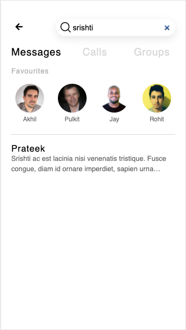

# Chat UI

## Table of Contents

- [Overview](#overview)
- [Highlights](#highlights)
- [Run Project](#run-project)

## Overview

Chat UI project allows a user to view all the chats in a messaging application. For easy access and navigation, the chats corresponding to favorite friends can also be viewed. When the user clicks on a favorite friend or a chat, the user is taken to the messages page where they can view all the messages in the conversation. A user can also search for a message on the chat page.

**Chats Page:**


**Messages Page:**


**Search Functionality:**



## Highlights

1. The pages are made for **mobile screens** hence they are responsive to small-screen devices only.  
   Please view the application on a mobile screen only.
2. A user can search for a message in the chat using the searchbar. Debouncing is applied on the search functionality so that the actual text is searched only after half second elapses from the time when the user stops typing in the search box.
3. The unread messages are highlighted on the chat page.
4. Longer messages are displayed in the form of ellipsis referring to 'more text'.
5. A user can click on the favorite friend to navigate to the messages page where they can view the entire conversation.
6. Typing a new message on the messages page shows a vertically growing text box as the user starts typing in a long message.
7. At present, the messages page shows messages corresponding to a single friend everytime irrespective of which favorite friend or chat a user clicks on. However, the messages displayed as part of the conversation on the messages page are being loaded dynamically.

## Run Project

1. Install [Node.js](https://nodejs.org/en/) on your machine.
2. Open your Terminal, go inside the project directory and run the following command:
   ```bash
   npm i
   ```
3. Run the following command inside the project directory in your Terminal:

   ```bash
   npm start
   ```

4. Open the following URL on your browser:

   [http://localhost:3000](http://localhost:3000)

5. **Right click on the browser page and click on 'Inspect Element' to open Developer Tools in the browser. Then click on 'Toggle Device Toolbar' icon to view the project on a mobile screen. (The shortcut key to view the mobile screen after opening Developer Tools in Chrome browser is Cmd + Shift + M on macOS machine).**  
   Select any mobile device and play with the project.
